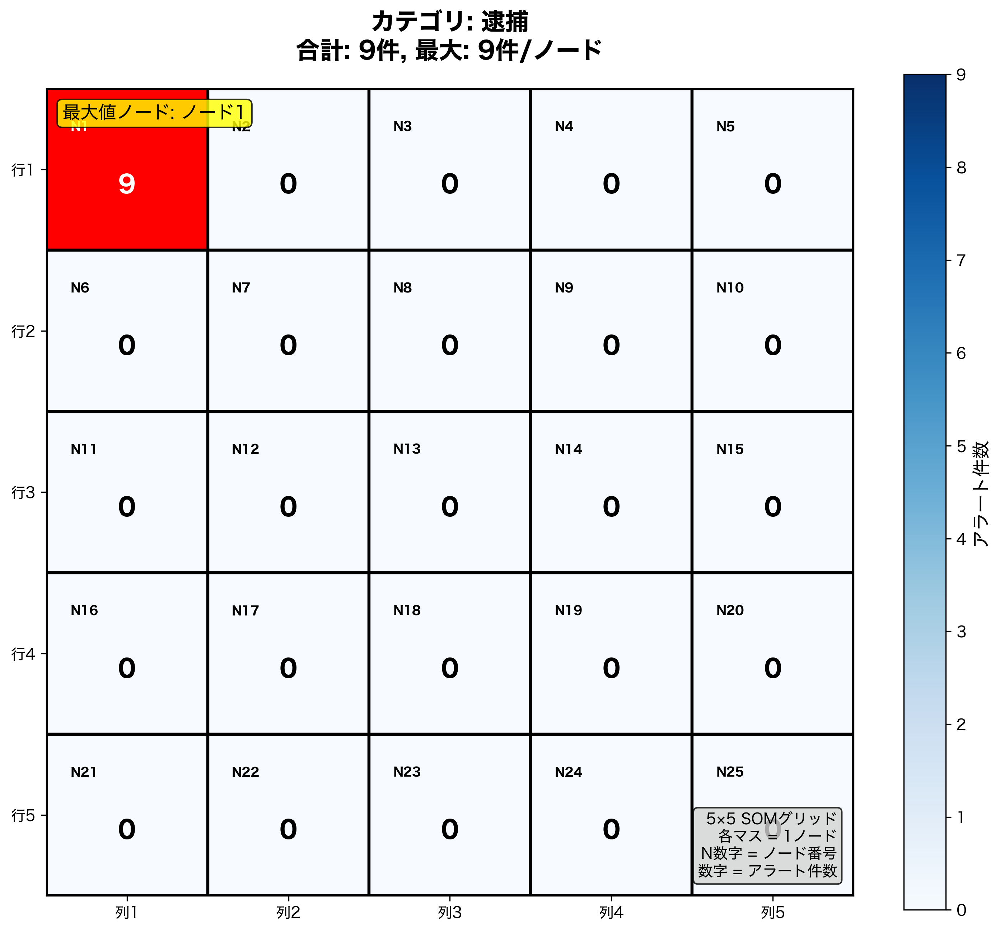
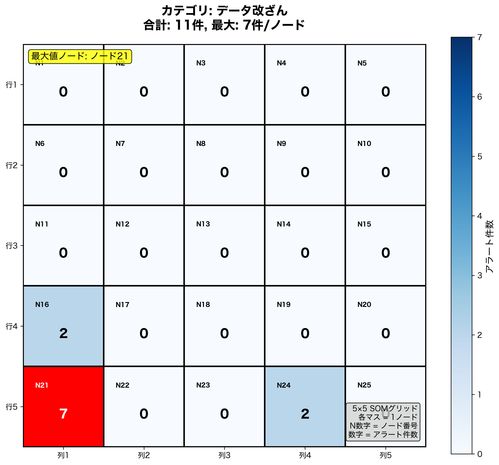
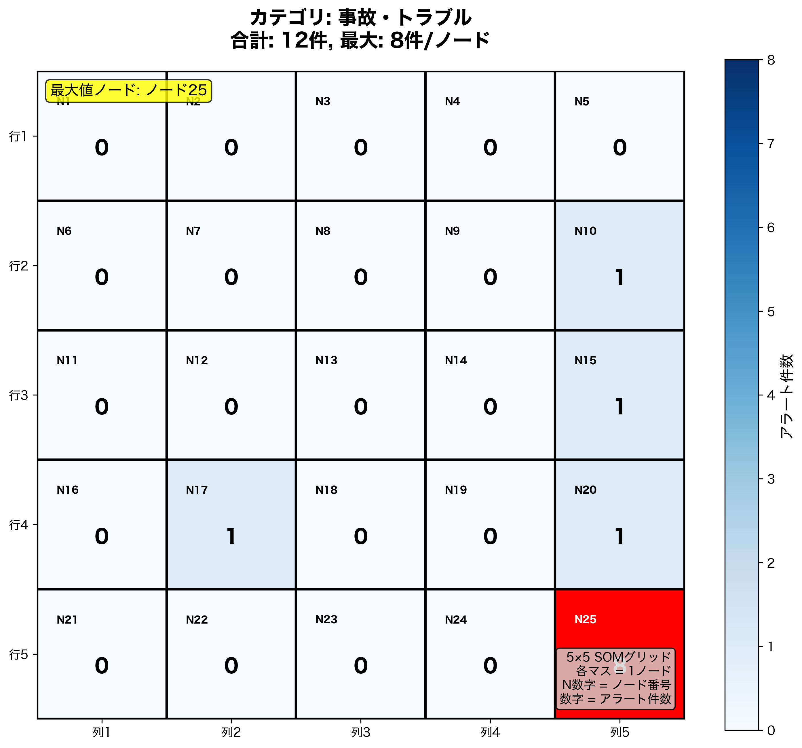

# ニュースアラート自動分類システム with SOM

## はじめに

大学で自己組織化マップ（SOM）について学びました。現在、ニュース情報の分析について考えているのですが、これを用いてニュースをベクトル化したものを分類できるのではないかと思いつきました。

ニュースのカテゴリについて、正解データを作って、SOM分析した結果に適用した結果と、事前に作った人肌のカテゴリについて、どれくらいの相関性があるのか気になって実行コードを作成してみました。

## やったこと

- **日本語ニュースの自動ベクトル化**: 最新のBERTモデルでテキストを数値化
- **SOMによる自動分類**: 似たような内容のニュースを自動でグループ分け
- **5×5グリッド可視化**: どのカテゴリがどこに集まっているか一目でわかる
- **完全自動処理**: CSVファイルを指定するだけで全自動実行

## 技術スタック

- **Python**: BERT変換・可視化
- **R**: SOM分析・統計処理
- **BERT**: 日本語テキストのベクトル化
- **Kohonen SOM**: 自己組織化マップによるクラスタリング

## 準備

### 必要なソフトウェア
- Python 3.8以上
- R 4.0以上
- Git

### セットアップ
```bash
# リポジトリをクローン
git clone <repository-url>
cd アラートSOM

# 仮想環境を作成・アクティベート
python3 -m venv .venv
source .venv/bin/activate

# Pythonパッケージをインストール
pip install transformers torch pandas fugashi protobuf ipadic unidic-lite matplotlib seaborn numpy

# Rパッケージをインストール
R -e "install.packages(c('kohonen', 'readr', 'dplyr'))"
```

## 操作方法

### ステップ1: データを準備する（ない場合は、sample_data.csvを用意しています！）
CSVファイルを以下の形式で準備してください：

```csv
quality_test_id,title,url,description,category
QT001,企業A、新商品を発表,https://example.com/1,企業Aが革新的な新商品を市場に投入,M&A・役員変更
QT002,企業B、データ改ざん発覚,https://example.com/2,企業Bでデータ改ざんが発覚,データ改ざん
```

### ステップ2: 分析を実行する
```bash
# シェルスクリプトを実行可能にする
chmod +x run_analysis.sh

# 分析を実行（ファイル名を指定）
./run_analysis.sh sample_data.csv
```

### ステップ3: 結果を確認する
`image/` フォルダ内に各カテゴリのグリッド可視化画像が生成されます！

## 結果

### 例1: 「逮捕」カテゴリの分析結果



**特徴:**
- 9件すべてがノード1に集中
- 「逮捕」に関するニュースは内容が似ているため、同じクラスターに分類
- 役員逮捕、現場責任者逮捕、経営陣逮捕など様々な逮捕関連ニュースが含まれる

### 例2: 「データ改ざん」カテゴリの分析結果



**特徴:**
- 11件中7件がノード21に集中
- データの隠蔽、偽装、操作など類似したキーワードで分類
- 製薬、製造業、食品業界など業界を問わず共通のパターンを検出

### 例3: 「事故・トラブル」カテゴリの分析結果



**特徴:**
- 12件中8件がノード25に集中
- 工場爆発、食中毒、製品リコールなど多様な事故が同じクラスターに
- 物理的な被害や影響を伴うニュースの共通パターンを抽出

## 🔍 グリッド画像の見方

各画像は5×5のグリッド（SOMの25ノード）を表しています：

- **N1〜N25**: ノード番号
- **数字（大）**: そのノードに分類されたアラート件数
- **色の濃度**: 件数が多いほど濃い青色、最大値は赤色で強調
- **統計情報**: 画像上部にカテゴリ名、合計件数、最大件数を表示

## カスタマイズ

### SOMのサイズを変更したい場合
`SOM解析.R` の以下の部分を修正：
```r
# 5x5 から 10x10 に変更する例
som_model <- som(data_matrix, grid = somgrid(10, 10, "hexagonal"))
```

### 可視化の色を変更したい場合
`SOM_可視化.py` の以下の部分を修正：
```python
# カラーマップを変更する例
cmap = plt.cm.Reds  # 青から赤に変更
```

「ニュース分析、面白そう！」と思った方は、ぜひスター⭐をお願いします！
質問や改善提案があれば、お気軽にIssueを立ててくださいね。 
